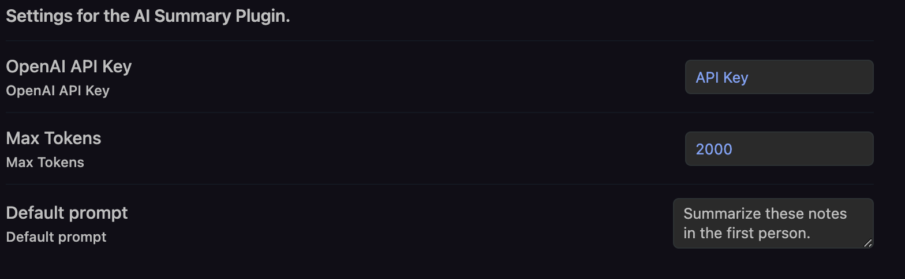

# Obsidian AI Summary Plugin

A plugin for [Obsidian](https://obsidian.md) that uses [OpenAI's GPT-3](https://openai.com/blog/openai-api/) to generate summaries of your notes. The plugin will look in the current note and find all the links to other notes. It will then generate a summary of each linked note and present it in a dialog.

The Prompt can be specified in the Front Matter of the note. If no prompt is specified, the plugin will use the default prompt specified in the settings.

This plugin is particularly useful for generating weekly (and monthly) summaries of your notes.

## 🚀 Installation & Setup

To use this plugin, you will need to have an OpenAI API key. You can get one from [OpenAI](https://beta.openai.com/). Once you have your key, you can enter it in the plugin settings. You can also specify a default prompt in the settings and maximum number of tokens to generate.

