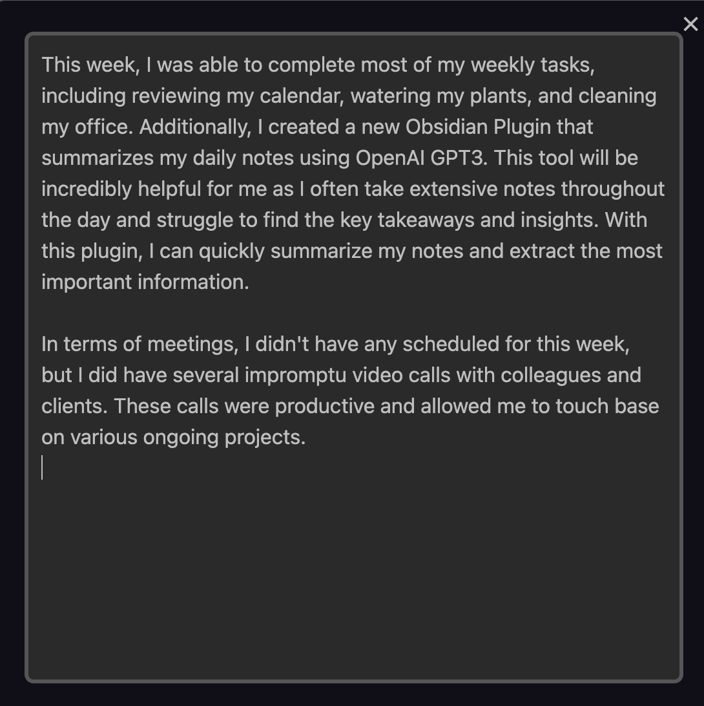

# Obsidian AI Summary Plugin

A plugin for [Obsidian](https://obsidian.md) that uses [OpenAI's GPT-3](https://openai.com/blog/openai-api/) to generate summaries of your notes. The plugin will look in the current note and find all the links to other notes. It will then generate a summary of each linked note and present it in a dialog. The plugin does not update your existing notes. It only generates a summary and presents it in a dialog. You can then copy the summary and paste it into your note.

The Prompt can be specified in the Front Matter of the note. If no prompt is specified, the plugin will use the default prompt specified in the settings.

This plugin is particularly useful for generating weekly (and monthly) summaries of your notes.

## 🚀 Installation & Setup

To use this plugin, you will need to have an OpenAI API key. You can get one from [OpenAI](https://beta.openai.com/). Once you have your key, you can enter it in the plugin settings. You can also specify a default prompt in the settings and maximum number of tokens to generate.


## 💪 Example Usage

The Obsidian AI Summary Plugin can be used to generate weekly summaries of your note. For example, if you create a weekly note called `2023-W01` with the following content:

```markdown
---
Prompt: Write me a 2-3 paragraph summary of the work I completed this week in the first person. The work completed is below the '# 🚀 Work Completed' section.
---

# 🚀 What Did I Do This Week 2023/2023-W01

# 📅 Daily Notes

- [[2023-01-02]]
- [[2023-01-03]]
- [[2023-01-04]]
- [[2023-01-05]]
- [[2023-01-06]]

```

You can use the plugin to summarize those daily notes.

 
